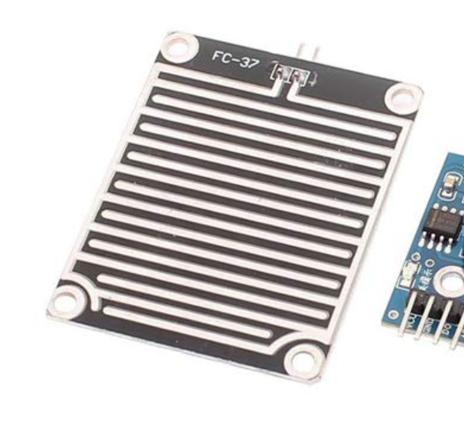
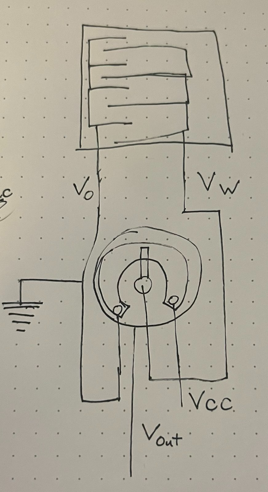
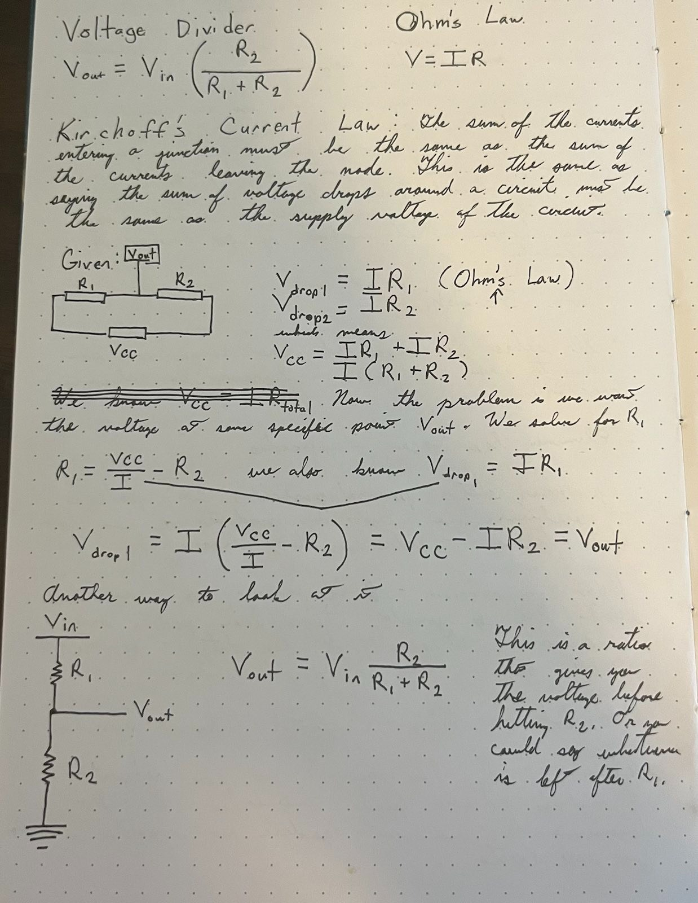

# RTS Rain Sensor

- [RTS Rain Sensor](#rts-rain-sensor)
  - [Helpful Links](#helpful-links)
  - [Parts](#parts)
  - [Work Log](#work-log)
    - [9 September 2023](#9-september-2023)
    - [10 September 2023](#10-september-2023)
  - [How it Works](#how-it-works)
    - [Potentiometer](#potentiometer)
      - [Components of a Potentiometer](#components-of-a-potentiometer)
      - [My Explanation](#my-explanation)
      - [Mathematical Modeling](#mathematical-modeling)

## Helpful Links

- https://circuitdigest.com/microcontroller-projects/interfacing-rain-sensor-with-arduino
- [Potentiometer: Definition, Types, and Working Principal](https://www.electrical4u.com/potentiometer/)

## Parts

- https://www.amazon.com/HiLetgo-Moisture-Humidity-Sensitivity-Nickeled/dp/B01DK29K28/ref=sr_1_2?keywords=arduino+rain+sensor&sr=8-2

## Work Log

### 9 September 2023

- Studied potentiometers
  - Wrote [my explanation](#my-explanation)
- Understood generally how the circuit works
- Started mathematically modeling the circuit
- Bought the rain sensor

### 10 September 2023

- Finished studying the math behind voltage divider circuits

## How it Works

- In dry conditions, there is some resistance between the conductive plates, but it's relatively high compared to a closed circuit. As a result, the voltage at the measuring point (between the sensor and ground) is relatively high, close to VCC.
- Rainfall Contact: When raindrops fall on the sensor and connect the conductive plates, they create a direct, low-resistance path between the sensor's two ends. This effectively shorts out the sensor, making the resistance between the plates extremely low.
- Voltage Drop: According to Ohm's law (V = IR), when resistance is very low (approaching zero), and there is a voltage source (VCC), the voltage drop across that low resistance becomes nearly zero. In practical terms, this means that the voltage at the measuring point drops to almost zero volts.

### Potentiometer

#### Components of a Potentiometer
A potentiometer has the following components:
- **Resistive Element:** This is a strip of resistive material, usually made of carbon, cermet, or conductive plastic. It determines the total resistance of the potentiometer.
- **Three Terminals:** A potentiometer has three terminals:
  - Two fixed outer terminals (often labeled as "1" and "3") connected across a voltage source (e.g., a power supply).
  - A movable [wiper terminal](#movable-wiper-terminal) (labeled as "2") that slides along the resistive element.

#### My Explanation

The way this works in a rain water sensor is you have $V_0$ connected to one set of conductive plates and the wiper of the potentiometer connected to the other set of conductive plates. $V_{CC}$ is connected to one terminal of the potentiometer and $V_0$ is connected to the other.

$V_{out}$ is effectively measuring the resistance between ground and the wiper. When it's dry, the resistance between the wiper and ground is really high. This correspondingly means that voltage difference between $V_{CC}$ and the wiper are less than $V_{CC}$ itself because the resistance between the two is just whatever the resistance of the potentiometer's resistant material is. However, if rain starts to fall on the rain water sensor, current passes between the two sets of conductive plates which then makes the wiper basically the same as ground - IE infinite resistance. This causes $V_{out}$ to spike so we know it's raining.

#### Mathematical Modeling

