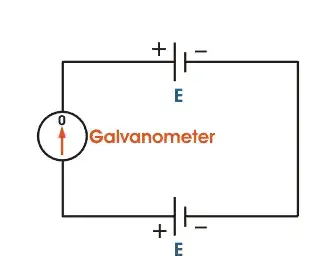

# RTS Rain Sensor

- [RTS Rain Sensor](#rts-rain-sensor)
  - [Helpful Links](#helpful-links)
  - [Parts](#parts)
  - [Work Log](#work-log)
    - [9 September 2023](#9-september-2023)
  - [How it Works](#how-it-works)
    - [Potentiometer](#potentiometer)
      - [Components of a Potentiometer](#components-of-a-potentiometer)
      - [My Explanation](#my-explanation)
      - [Mathematical Modeling](#mathematical-modeling)
    - [Kirchoff's Current Law (KCL)](#kirchoffs-current-law-kcl)
      - [Intuitive Explanation of Current Flow](#intuitive-explanation-of-current-flow)
    - [Voltage Divider Formula](#voltage-divider-formula)
    - [Rotary Potentiometer](#rotary-potentiometer)

## Helpful Links

- https://circuitdigest.com/microcontroller-projects/interfacing-rain-sensor-with-arduino
- [Potentiometer: Definition, Types, and Working Principal](https://www.electrical4u.com/potentiometer/)

## Parts

- https://www.amazon.com/HiLetgo-Moisture-Humidity-Sensitivity-Nickeled/dp/B01DK29K28/ref=sr_1_2?keywords=arduino+rain+sensor&sr=8-2

## Work Log

### 9 September 2023

- Studied potentiometers
  - Wrote [my explanation](#my-explanation)
- Understood generally how the circuit works
- Started mathematically modeling the circuit
- Bought the rain sensor

## How it Works

- In dry conditions, there is some resistance between the conductive plates, but it's relatively high compared to a closed circuit. As a result, the voltage at the measuring point (between the sensor and ground) is relatively high, close to VCC.
- Rainfall Contact: When raindrops fall on the sensor and connect the conductive plates, they create a direct, low-resistance path between the sensor's two ends. This effectively shorts out the sensor, making the resistance between the plates extremely low.
- Voltage Drop: According to Ohm's law (V = IR), when resistance is very low (approaching zero), and there is a voltage source (VCC), the voltage drop across that low resistance becomes nearly zero. In practical terms, this means that the voltage at the measuring point drops to almost zero volts.

### Potentiometer

#### Components of a Potentiometer
A potentiometer has the following components:
- **Resistive Element:** This is a strip of resistive material, usually made of carbon, cermet, or conductive plastic. It determines the total resistance of the potentiometer.
- **Three Terminals:** A potentiometer has three terminals:
  - Two fixed outer terminals (often labeled as "1" and "3") connected across a voltage source (e.g., a power supply).
  - A movable [wiper terminal](#movable-wiper-terminal) (labeled as "2") that slides along the resistive element.

#### My Explanation

The way this works in a rain water sensor is you have $V_0$ connected to one set of conductive plates and the wiper of the potentiometer connected to the other set of conductive plates. $V_CC$ is connected to one terminal of the potentiometer and $V_0$ is connected to the other.

$V_out$ is effectively measuring the resistance between ground and the wiper. When it's dry, the resistance between the wiper and ground is really high. This correspondingly means that voltage difference between $V_CC$ and the wiper are less than $V_CC$ itself because the resistance between the two is just whatever the resistance of the potentiometer's resistant material is. However, if rain starts to fall on the rain water sensor, current passes between the two sets of conductive plates which then makes the wiper basically the same as ground - IE infinite resistance. This causes $V_out$ to spike so we know it's raining.

#### Mathematical Modeling

The voltage divider principle states that if you have a resistor network or a wire with varying resistance (like the potentiometer's resistive element), the voltage at any point along that resistor network is proportional to the resistance between that point and one of the voltage references (in this case, $V_CC$ and ground).

The equation 

$$
V_{\text{out}} = V_{\text{CC}} \cdot \frac{R_{\text{WG}}}{R_{\text{total}}}
$$

is based on the principle of a voltage divider. In a potentiometer circuit, the voltage at the center terminal ($V_{\text{out}}$) is determined by the division of voltage across a resistor network, which includes the potentiometer's internal resistor.

Here's why this equation is used:

- **Voltage Divider Principle:** When you have two resistors in series, with a voltage source connected across them, the voltage at the point between the two resistors is determined by the ratio of the resistances. This is a fundamental principle known as the voltage divider formula.

- **Potentiometer as a Variable Resistor:** A potentiometer is essentially a variable resistor with three terminals: one fixed terminal, one movable wiper terminal, and one center output terminal. As you move the wiper along the resistive element, you change the resistance between the wiper and one end (connected to \(V_{\text{CC}}\)).

- **Center Terminal Voltage:** The voltage at the center terminal (\(V_{\text{out}}\)) is the voltage you measure or use for various applications. It depends on the division of resistance within the potentiometer.

- **Voltage Divider Equation:** The voltage at the center terminal can be calculated using the voltage divider formula:

$$
V_{\text{out}} = V_{\text{CC}} \cdot \frac{R_{\text{WG}}}{R_{\text{total}}}
$$

- \(V_{\text{out}}\) is the voltage at the center terminal.
- \(V_{\text{CC}}\) is the power supply voltage.
- \(R_{\text{WG}}\) is the resistance between the wiper and ground.
- \(R_{\text{total}}\) is the total resistance of the potentiometer's internal resistor.

In the context of a rain sensor using a potentiometer, this equation is used to relate the position of the wiper (and the corresponding resistance \(R_{\text{WG}}\)) to the output voltage \(V_{\text{out}}\). When rainwater changes the resistance between the wiper and ground, it affects \(V_{\text{out}}\) accordingly, allowing the sensor to detect and measure rainfall intensity.

### Kirchoff's Current Law (KCL)

According to Kirchhoff's current law (KCL), the sum of currents entering a node (or junction) must equal the sum of currents leaving that node. In this case, the "node" is the point where the batteries and the galvanometer are connected together.

- V1 be the voltage of the first battery.
- V2 be the voltage of the second battery.

Since the batteries are connected in parallel, V1 = V2.

- I1 be the current through the first battery (from positive to negative terminal).
- I2 be the current through the second battery (from positive to negative terminal).
- Ig be the current through the galvanometer.
According to KCL at the node where the batteries and the galvanometer are connected:

I1 + I2 - Ig = 0

However, since V1 = V2, the potential difference across the galvanometer (Vg) is zero:

Vg = 0

Therefore, according to Ohm's law (V = IR), if Vg = 0, then Ig = 0:

Ig = 0

This is why the galvanometer shows null deflection when the electric potentials of both battery cells are exactly the same.

#### Intuitive Explanation of Current Flow

Imagine two water tanks placed side by side, representing batteries, and they are connected at the bottom by a pipe, symbolizing the connection between the batteries:

1. **Water Level Represents Voltage:** In this analogy, the water level in each tank represents the voltage of the batteries. If both tanks have the same water level, it means they have the same potential energy.
2. **Flow of Water Represents Current:** Water flows from a higher level to a lower level due to gravity, similar to electric current flowing from a higher voltage to a lower voltage.
3. **Parallel Connection:** When the two tanks are connected at the bottom by the pipe, it's like connecting batteries in parallel. The water levels in both tanks are at the same height, indicating the same potential energy.
4. **No Flow of Water:** Because the water levels are the same, there is no difference in potential energy between the two tanks. As a result, water doesn't flow from one tank to the other; it remains at the same level in both tanks.
5. **Analogous to Electrical Scenario:** This situation is analogous to connecting two batteries with the same voltage in parallel. Since they have the same voltage (potential energy), there is no voltage difference to drive electric current between them. Therefore, no electric current flows through the circuit.

### Voltage Divider Formula

The voltage divider formula is a fundamental equation used in electrical engineering to calculate the output voltage ($V_{out}$) across a specific component or point in a circuit when a known input voltage ($V_{in}$) is applied across a series of resistors or components connected in series. It is often used with resistors in voltage divider circuits.

The voltage divider formula can be expressed as:

$$
V_{out} = V_{in} \cdot \frac{R_2}{R_1 + R_2}
$$

Where:
- $V_{out}$ is the output voltage (the voltage across the component of interest).
- $V_{in}$ is the input voltage (the voltage applied across the entire series circuit).
- $R_1$ is the resistance of the first resistor or component in the series.
- $R_2$ is the resistance of the second resistor or component in the series.

This formula allows you to calculate the voltage drop or voltage across a specific resistor or component in a series circuit when you know the values of the resistors and the input voltage. It is widely used in circuit analysis to determine voltage levels at different points in a circuit.

It's important to note that the voltage divider formula is based on the principle that the voltage drop across a resistor is proportional to its resistance relative to the total resistance in the series circuit. The higher the resistance of a component compared to the total resistance, the larger the voltage drop across that component.

### Rotary Potentiometer

A rotary potentiometer is an electrical component with a variable resistor. It consists of three terminals: two fixed terminals, often labeled A and B, and a movable wiper terminal W. The resistive element of the potentiometer has a total resistance value denoted as $R_{\text{total}}$.

1. **Resistance Between A and W (R_AW):**
   - The resistance between terminal A and the wiper terminal W ($R_{\text{AW}}$) varies based on the position of the wiper along the resistive element. It can be calculated as a fraction of the total resistance:
   
   $$R_{\text{AW}} = \frac{\text{Position}_{\text{W}}}{R_{\text{total}}} \cdot R_{\text{total}}$$

   - Where:
     - $\text{Position}_{\text{W}}$ is the position of the wiper along the resistive element (typically expressed as a fraction from 0 to 1).

2. **Resistance Between B and W (R_BW):**
   - The resistance between terminal B and the wiper terminal W ($R_{\text{BW}}$) is complementary to $R_{\text{AW}}$ and can be calculated as:
   
   $$R_{\text{BW}} = R_{\text{total}} - R_{\text{AW}}$$

   - Since the total resistance minus the resistance from A to W gives the resistance from B to W.

3. **Voltage Output (V_out):**
   - To determine the voltage output at the wiper terminal W, you can use the voltage divider formula, which relates the resistance values and the input voltage ($V_{\text{in}}$):
   
   $$V_{\text{out}} = V_{\text{in}} \cdot \frac{R_{\text{AW}}}{R_{\text{total}}}$$

   - Where:
     - $V_{\text{in}}$ is the voltage applied across terminals A and B.
     - $R_{\text{AW}}$ is the resistance between terminal A and the wiper terminal W.
     - $R_{\text{total}}$ is the total resistance of the potentiometer's resistive element.

By adjusting the position of the wiper, you can vary $R_{\text{AW}}$, which, in turn, affects the voltage output at terminal W. This enables precise control of voltage levels in a circuit connected to the potentiometer.
